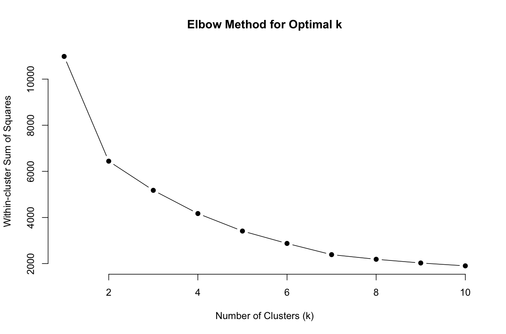
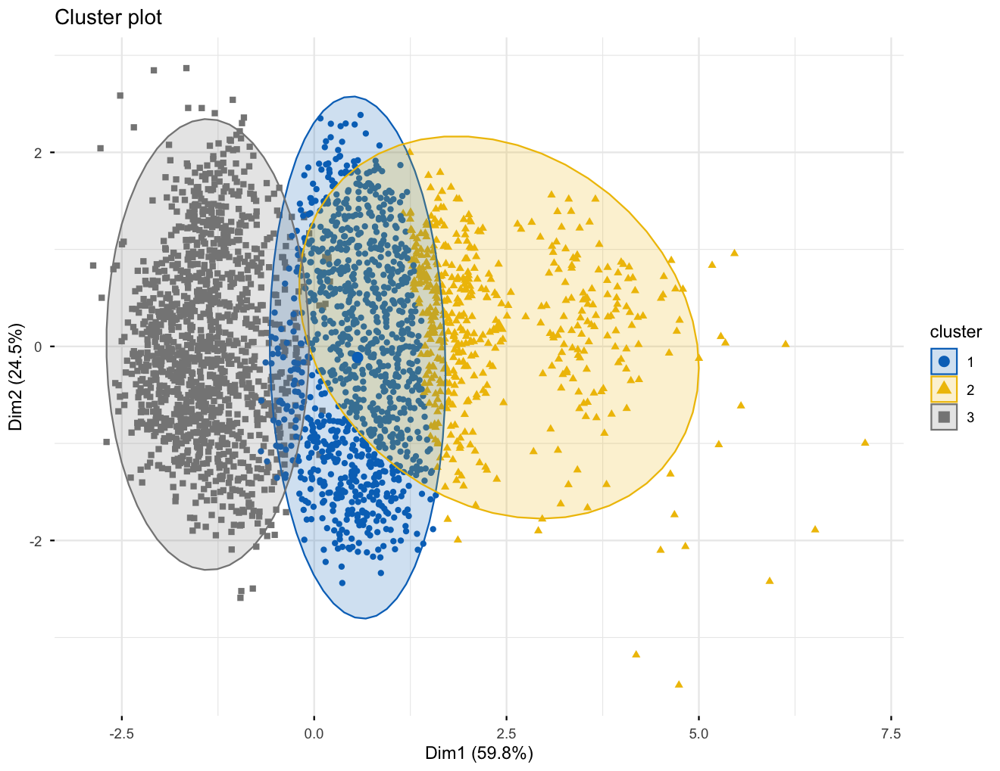

# Auto Sales Customer Segmentation
### K-Means Clustering · Conjoint Analysis · Discriminant Analysis · R

---

## Overview
Multi-method analysis of an automotive B2B sales dataset (2,800+ orders,
90+ customers) using three statistical techniques implemented in R.

Developed as part of the Data Science using R module, MSc Business
Analytics, University College Dublin (2024–25).

---

## Analyses performed

### 1. Cluster analysis (K-Means)
Segmented customers based on sales behaviour using four features:
SALES, QUANTITY ORDERED, DAYS SINCE LAST ORDER, and DEAL SIZE.

Applied the elbow method to identify k=3 as the optimal number of clusters.
Results identified three distinct customer groups:

| Segment | Avg Days Since Order | Avg Sales | Avg Qty | Characteristic |
|---|---|---|---|---|
| Champions | [X] days | $[X] | [X] | Recent, high-value buyers |
| At Risk | [X] days | $[X] | [X] | Previously active, now lapsing |
| Dormant | [X] days | $[X] | [X] | Low engagement, low spend |

*(Fill these in from your kmeans_model$centers output)*

### 2. Conjoint analysis
Modelled the relative importance of product attributes (Product Line,
MSRP, Price Each) on customer ratings using a linear regression utility
model. Identified which product features most strongly drive
customer preference.

### 3. Discriminant Analysis (LDA)
Built a Linear Discriminant Analysis model to classify order status
(Shipped, Cancelled, On Hold etc.) from three predictors:
QUANTITY ORDERED, SALES, and PRICE EACH.

Model accuracy: [X]%

---

## Key findings
- [Your most interesting finding from clustering]
- [Your most interesting finding from conjoint]
- [Your LDA accuracy — e.g. "LDA achieved 84% accuracy in predicting order status"]

---

## Tools and packages
R · tidyverse · cluster · factoextra · ggplot2 · MASS (LDA) · conjoint

---

## How to reproduce
1. Download the Auto Sales dataset from Kaggle:
   [https://www.kaggle.com/datasets/ddosad/auto-sales-data]
2. Save as `data/raw/auto_sales_data.csv`
3. Open RStudio and run scripts in order:
   - `scripts/01_cluster_analysis.R`
   - `scripts/02_conjoint_analysis.R`
   - `scripts/03_discriminant_analysis.R`

---

## Output plots

### Elbow curve — choosing optimal k

### Customer cluster visualisation

---

## Skills demonstrated
K-Means clustering · Feature scaling · Elbow method · PCA visualisation ·
Conjoint analysis · Linear Discriminant Analysis ·
R programming · ggplot2 · Business insight communication